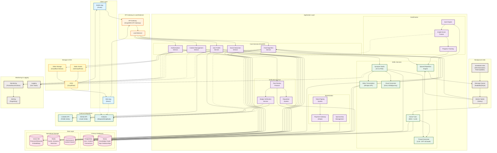

```mermaid
graph TB
    subgraph "Client Layer"
        Mobile["Mobile App<br/>(Flutter)"]
        Web["Web App<br/>(React)"]
    end

    subgraph "API Gateway & Load Balancer"
        Gateway["API Gateway<br/>(Kong/AWS API Gateway)"]
        LB["Load Balancer"]
    end

    subgraph "Application Layer"
        subgraph "Core Services (FastAPI)"
            Auth["Authentication<br/>Service"]
            User["User Profile<br/>Service"]
            Content["Content Management<br/>Service"]
            Feed["Feed Algorithm<br/>Service"]
            Social["Social Interaction<br/>Service"]
        end
        
        subgraph "AI/ML Services"
            AIStudio["Synapse Studio<br/>(AI Co-Pilot)"]
            Transcribe["Video Transcription<br/>(Whisper API)"]
            ThreadGen["Thread Generator<br/>(LLM - GPT-4/Claude)"]
            VisualGen["Visual Generator<br/>(DALL-E/Midjourney)"]
            Tutor["Active Tutor<br/>(RAG + LLM)"]
            SRS["Spaced Repetition<br/>Engine"]
        end
        
        subgraph "Verification & Trust"
            PeerReview["Peer Review<br/>Protocol"]
            Reputation["Reputation<br/>System"]
            BadgeVerify["Badge Verification<br/>Service"]
        end
        
        subgraph "Gamification"
            Insight["Insight Score<br/>Tracker"]
            Quiz["Quiz Engine"]
            Progress["Progress Tracking"]
        end
        
        subgraph "Monetization"
            Payment["Payment Gateway<br/>(Stripe)"]
            Sponsor["Sponsorship<br/>Management"]
            Token["Token/Tipping<br/>System"]
        end
    end

    subgraph "Data Layer"
        subgraph "Primary Databases"
            Postgres[(PostgreSQL<br/>User, Content,<br/>Transactions)]
            Neo4j[(Neo4j<br/>Knowledge Graph<br/>Topic Relationships)]
        end
        
        subgraph "Specialized Storage"
            Vector[(Vector DB<br/>Pinecone/Weaviate<br/>Embeddings)]
            Redis[(Redis<br/>Cache, Sessions,<br/>Real-time)]
            Elastic[(Elasticsearch<br/>Content Search)]
        end
    end

    subgraph "Storage & CDN"
        Video["Video Storage<br/>(Cloudflare Stream)"]
        Static["Static Assets<br/>(S3/CloudFront)"]
        CDN["CDN<br/>(CloudFlare)"]
    end

    subgraph "External Integrations"
        LinkedIn["LinkedIn API<br/>(Profile Verify)"]
        GitHub["GitHub API<br/>(Code Verify)"]
        Analytics["Analytics<br/>(Mixpanel/Amplitude)"]
    end

    subgraph "Background Jobs"
        Queue["Message Queue<br/>(RabbitMQ/SQS)"]
        Workers["Worker Nodes<br/>(Celery)"]
        Cron["Scheduled Jobs<br/>(SRS Reminders,<br/>Feed Updates)"]
    end

    subgraph "Monitoring & Logging"
        Monitor["Monitoring<br/>(Prometheus/Grafana)"]
        Logs["Logging<br/>(ELK Stack)"]
        Alerts["Alerting<br/>(PagerDuty)"]
    end

    %% Client connections
    Mobile --> Gateway
    Web --> Gateway
    Gateway --> LB
    
    %% Gateway to services
    LB --> Auth
    LB --> User
    LB --> Content
    LB --> Feed
    LB --> Social
    
    %% Core service connections
    Auth --> Postgres
    Auth --> Redis
    User --> Postgres
    User --> Neo4j
    User --> LinkedIn
    User --> GitHub
    
    Content --> Postgres
    Content --> Video
    Content --> Static
    Content --> AIStudio
    
    Feed --> Neo4j
    Feed --> Vector
    Feed --> Redis
    Feed --> SRS
    
    Social --> Postgres
    Social --> Redis
    Social --> PeerReview
    
    %% AI Studio connections
    AIStudio --> Transcribe
    AIStudio --> ThreadGen
    AIStudio --> VisualGen
    AIStudio --> Vector
    
    %% Tutor connections
    Tutor --> Vector
    Tutor --> Neo4j
    Tutor --> ThreadGen
    
    %% Verification connections
    PeerReview --> Reputation
    PeerReview --> BadgeVerify
    PeerReview --> Postgres
    Reputation --> Neo4j
    BadgeVerify --> LinkedIn
    BadgeVerify --> GitHub
    
    %% Gamification connections
    Quiz --> Postgres
    Quiz --> Insight
    Insight --> Progress
    Progress --> SRS
    SRS --> Queue
    
    %% Monetization connections
    Payment --> Postgres
    Sponsor --> Postgres
    Token --> Payment
    
    %% CDN connections
    Video --> CDN
    Static --> CDN
    CDN --> Mobile
    CDN --> Web
    
    %% Background processing
    Queue --> Workers
    Workers --> SRS
    Workers --> Feed
    Workers --> Tutor
    Cron --> Queue
    
    %% Search
    Content --> Elastic
    Feed --> Elastic
    
    %% Monitoring
    Auth -.-> Monitor
    Content -.-> Monitor
    Feed -.-> Monitor
    AIStudio -.-> Monitor
    Monitor --> Alerts
    
    %% Logging
    Auth -.-> Logs
    Content -.-> Logs
    Feed -.-> Logs
    AIStudio -.-> Logs
    
    %% Analytics
    Mobile -.-> Analytics
    Web -.-> Analytics
    Social -.-> Analytics
    Insight -.-> Analytics

    classDef client fill:#e1f5ff,stroke:#01579b,stroke-width:2px
    classDef api fill:#fff3e0,stroke:#e65100,stroke-width:2px
    classDef service fill:#f3e5f5,stroke:#4a148c,stroke-width:2px
    classDef ai fill:#e8f5e9,stroke:#1b5e20,stroke-width:2px
    classDef data fill:#fce4ec,stroke:#880e4f,stroke-width:2px
    classDef storage fill:#fff9c4,stroke:#f57f17,stroke-width:2px
    classDef external fill:#e0f2f1,stroke:#004d40,stroke-width:2px
    classDef monitor fill:#efebe9,stroke:#3e2723,stroke-width:2px
    
    class Mobile,Web client
    class Gateway,LB api
    class Auth,User,Content,Feed,Social,PeerReview,Reputation,BadgeVerify,Insight,Quiz,Progress,Payment,Sponsor,Token service
    class AIStudio,Transcribe,ThreadGen,VisualGen,Tutor,SRS ai
    class Postgres,Neo4j,Vector,Redis,Elastic data
    class Video,Static,CDN storage
    class LinkedIn,GitHub,Analytics external
    class Queue,Workers,Cron,Monitor,Logs,Alerts monitor
```